# Real-Twin

**(Feel free to revise the document to enhance the accuracy and readability)**

ORNL’s Real-Twin project is a streamlined scenario generation tool that automatically integrates real-world traffic data to create high-fidelity digital twins for simulating the impacts of connected and automated vehicles in microsimulation environments.

## Change Log

**Change Log section will eventually be moved to CHANGLOG.md (currently maintained in README.md for development).**

### 2025-05-29

* Not create OpenDrive file if inc_sumo_net assigned in generate_inputs()
* Not create SUMO network from vertices if it exists (might take long time generating sumo network)

TODO

* Could not load / create flow data as junction attributes might changed from user and this will cause error in creating inflow data.

### 2025-05-28

* Auto selection calibration variables for turn and inflow
* Clean up input configuration file to minimize user inputs
* Format print out message for better message noticing
* Force to terminate the program after the generation of Matchup Table.
* 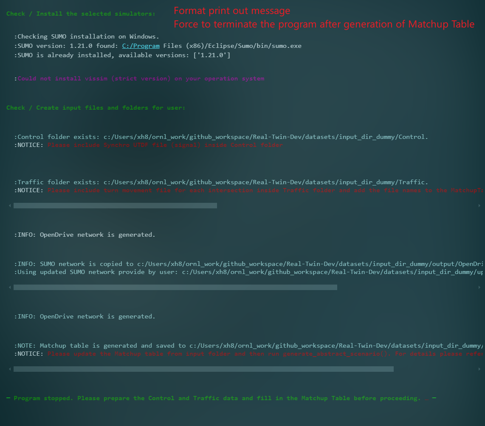

### 2025-05-26

* Add Python 3.10 as minimum Python version.
* Generate Matchup Table on each time of running generate_inputs(), will re-write existing Matchup Table.
* Update logic for user updated SUMO network

### 2025-05-23

* Updates input configuration: reduced inputs from **300** lines to **65** lines
* Standardlize behavior inputs
* Integrated behavior calibration
* Update readthedocs

  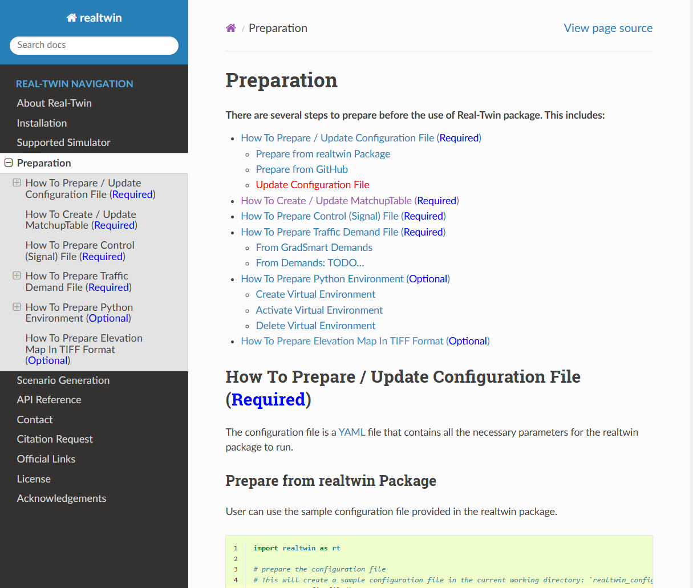

### 2025-05-22

Integration of Turn and inflow as there are errors and changes from updated code and updated processing logic.

Details:

* 1. Refactor code
* 2. Fix bugs in converting SUMO net.xml to OpenDrive .xdor (Edge ids are not consistent)
* 3. Generate executable .sunocfg before calibration (not executable in previous version)
* 4. Add logic with enable user their updated .net.xml file

TODO: continue work on Behavior calibration integration based on updated code.

### 2025-05-07

* Update readthedocs (65% Done)

  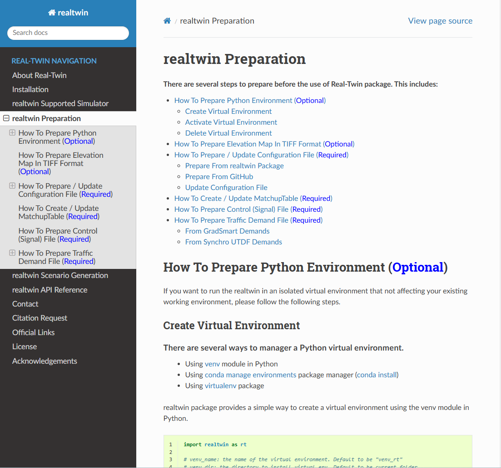
* Fix concrete generateion bugs

### 2025-05-06

* Add **demo_data: bool | string** in configuration file to enable sample data. If demo_data is true, use default data from illusstration, if the data name specified, use data from database server or data library.
* Add create_configuration_file function to generate the default configuration file to user, user can then edit the configuration as input of realtwin generation.
* Update AbstractScenario generation with including matchup table generation, folders checking (Traffic and Control)
* Update ConcreateScenario generation with updated traffic and control generation

### 2025-03-24

* update realthedocs (30%)

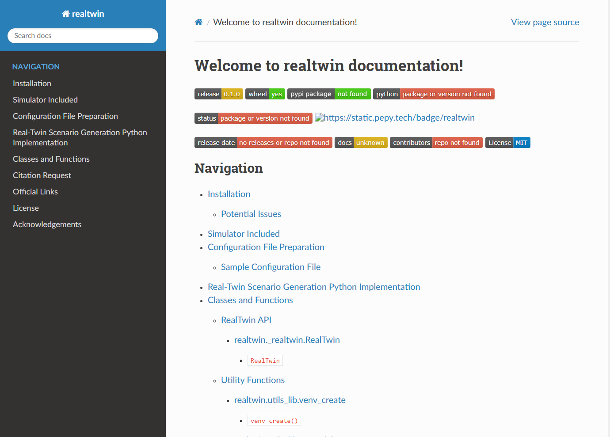

### 2025-03-19

* prepare realtwin ico for readthedocs
* prepare readthedocs (20%)

TODO: 1. continue working on readthedocs 2. format docstring for functions and classes 3. Learn documentation on real-twin project project

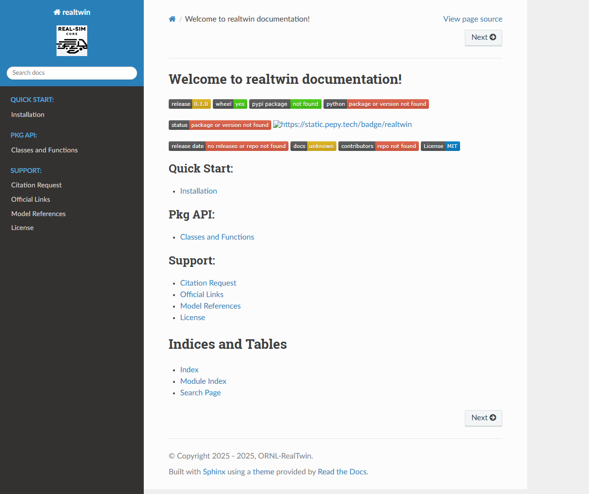

### 2025-03-18

* update code to run both original and new implementations in Calibration section
* test two sets of algorithms
* update code using universal configuration data
* TODO: 1. refactor code 2. test scenarioes (multiple combinations between turn_inflow and behavior) 3. fix potential errors from package

### 2025-03-17

* Re-design configuration file for better implementation and user-friendly midification
* Update cooresponding codes based on updates from configurations

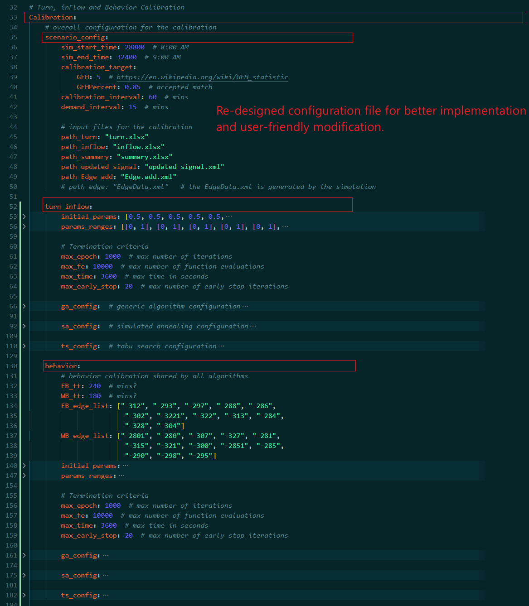

### 2025-03-12

* updated behavior optimization using mealpy

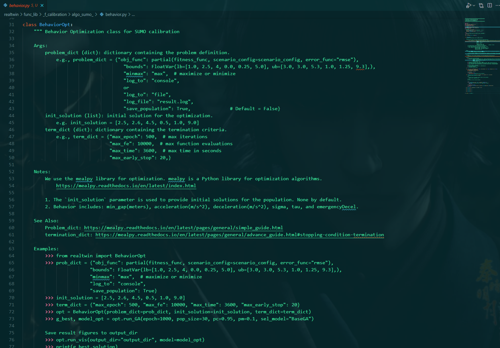

TODO: Integrate BehaviorOpt into realtwin packagte. Convert Turn and Inflow (mealpy)

### 2025-03-06

Update tuturial_dev.py and tutorial_dev.md for detailed examples

refactorred realtwin code

### 2025-03-05

1. Updated framework dragram

   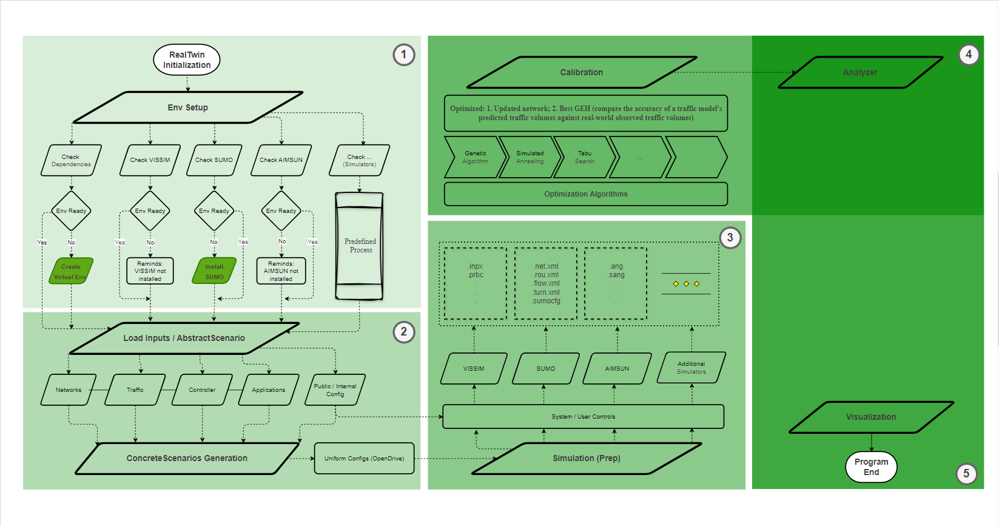
2. Explore mealpy...

### 2025-03-04

1. Create public repo: Real-Twin
2. Rename old repo to: Real-Twin-Dev

### 2025-02-28

#### Open Discussion

1. Calibration section, the current implementation is:
   Step 1: optimize Turn and Inflow, based on the optimized results(net, turn, flow, EdgeData, ect...)

   Step 2: perform Behavior optimization to generate results

   My question is: how can we make sure that we obtained the best reslution? Will step 2 change best results from step 1?

   As this is multi-objective optimization problem, if it's possible to perform turn and inflow optimization as objective 1, behavior optimization as objective 2 and optimize best results then?
2. Calibration fail on generated netwrokOne issue is that the generated network (abstract -> concreate -> simulation generation)  failed in calibration (I noticed that calibration section requires modified data and the generated network, such as chatt.net.xml, could not run in current stage). The generated network does not have additional files such as turn.xlsm, flow.xlsm, summary.csv ect...

   In this regard, we have to separate between part 1: (abstract -> concrete -> simulation preparation) and part 2: Calibration section.  Current implementation(TODO):  We can generate the network from part 2, but on part 2, we will use default data (not generated network) to calibrate results.  Any feedback?

Calibration integrated into realtwin package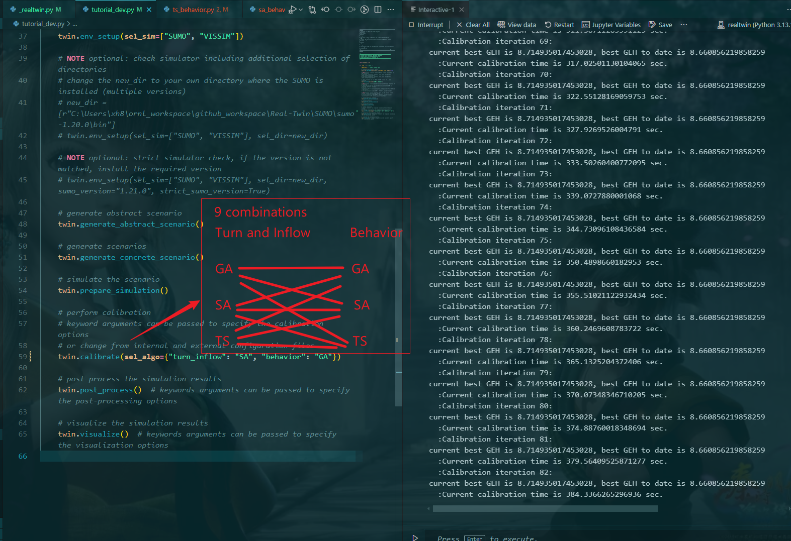

#### TODO

* refactor codes
* clean up unnecessary inputs / configs

### 2025-02-27

#### Discussion

* Input files are mixing of xlsx, csv files. We need to choose either xlsx or csv to make inputs uniform

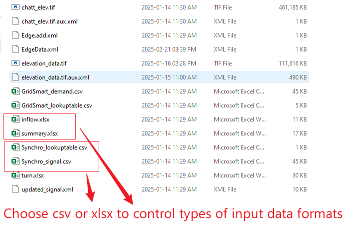

* The generated SUMO network failed during the calibration process.
* Decide whether to create public or private real-twin repositories on GitHub.
* Achieve 60% integration of the calibration section.

#### TODO

    Continueous integration contineous delivery

### 2025-01-24

* realtwin package enables Abstrace Scenario, Concrete Scenario, and Simulation generation using SUMO
* code checking and updates to score of 9.5+ / 10
* updated test functions
* update gitignore file to ignore .tif files as .tif files are too large (100MB+)
* update tutorial_dev to make clear explanation for both user and internal developers
* update requirements to enable simulation
* update configuration file to auto load  and fill missing data from loading

  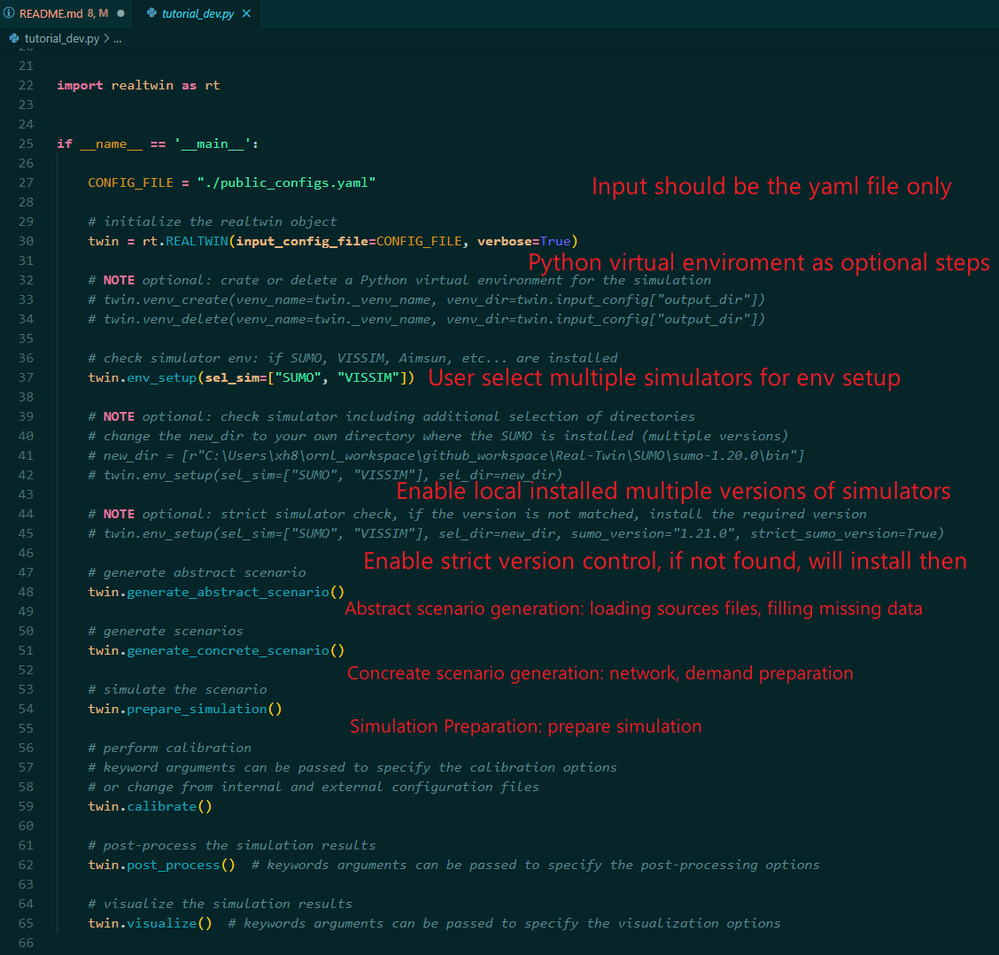

#### TODO

* Explore calibration codes for sumo

### 2025-01-03

* add several test functions: find executable, download file, simulation environment ect...
* get familiar with existing framework, eg. scenariogeneration, utdf singal conversion from Guanhao's code ect...

#### TODO

* need more time to get familar with the currently framework - current SOW, time plan, develiverables ect...

### 2024-12-31

* add func: sumo version check from all existing exectuables
* add func: enable strick sumo version check: if not installed, will install the specific version of sumo
* add func: download large single file from web with security check and process checking
* add func: find executable from system path
* add func: find executable from selected directory
* fmt: format print out message for better progress representation

  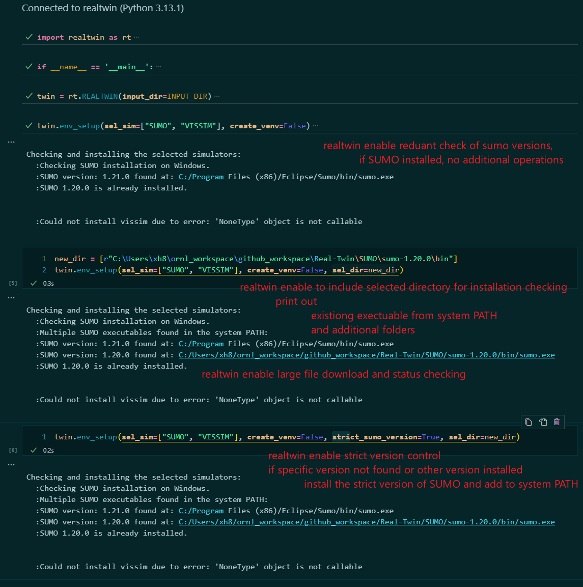

#### TODO

* get familiar with input loads (request access to shared local testing files)
* get familiar with existing visualizations (coordinate with group members and request access to their local files)

### 2024-12-30

* add tutorial_dev.md file for user & developer reference
* add test functions for the input_dir, output_dir ect...
  figure

#### TODO

* check sumo version if sumo pre-installed on user's device
* get familiar with input loads (request access to shared local testing files)
* get familiar with existing visualizations (coordinate with group members and request access to their local files)

### 2024-12-27

* add .pylintrc file for project-wide coding control
* refactored code to reach production-level
* test the current functionalities: including create venv, delete venv, check SUMO and install SUMO
* tutorial_dev.py

  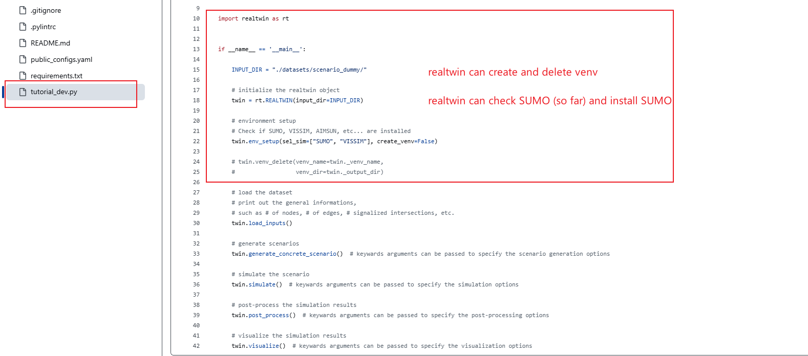

#### TODO:

* Discussion the repository license: MIT, Apache, BSD etc..., as we are writing code, we need copyright licence text as Docstring at the top of each file created.
* Add test functions perform object safety check

### 2024-12-26

* enable pylint for checking / evaluating coding for GitHub Action
* add code evaluation fuction (local checking) to perform code checking and evaluation (navigate to tests folder: pylint_proj_code_checker.py)
* update requirements.txt
* add official copyright for each document for the requirement of software development under ORNL
* add test functions

#### TODO:

* discuss the repository license: MIT, Apache, BSD etc..., as we are writing code, we need copyright licence text as Docstring at the top of each file created.
* add more test functions perform object safety check

### 2024-12-23

* re-design the realtwin development framework
* re-design the overall package framework
* add utility functions: is_sumo_installed
* add utility functions: venv_create, venv_delete
* add func_lib in install_simulator: install_sumo_windows
* add test function: test_is_sumo_installed
* 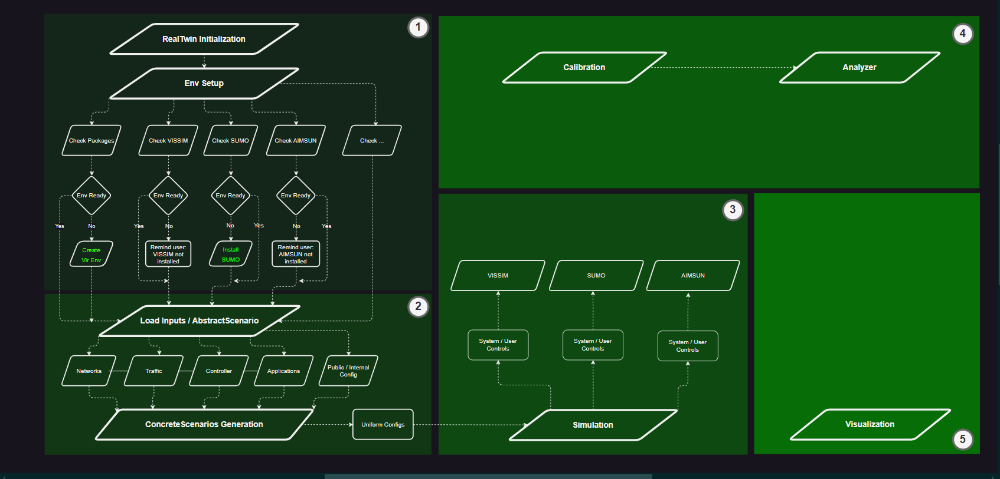

#### TODO:

* Test the overall functionalities
