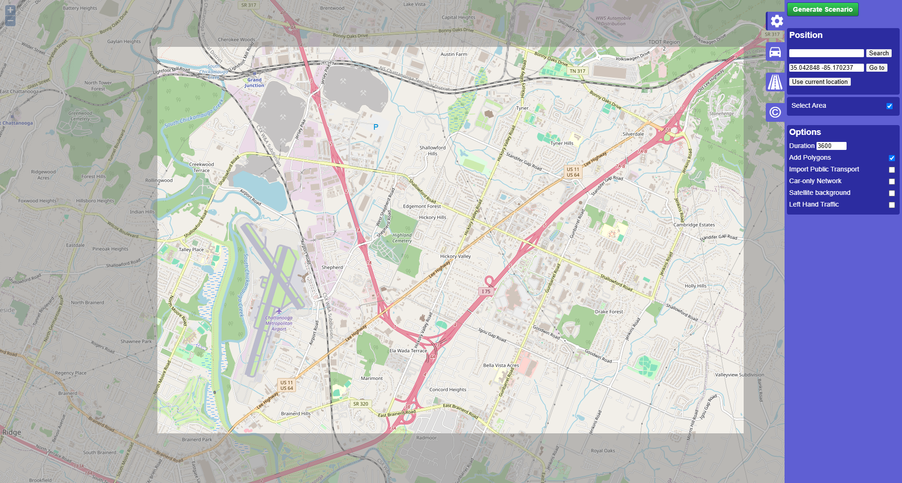
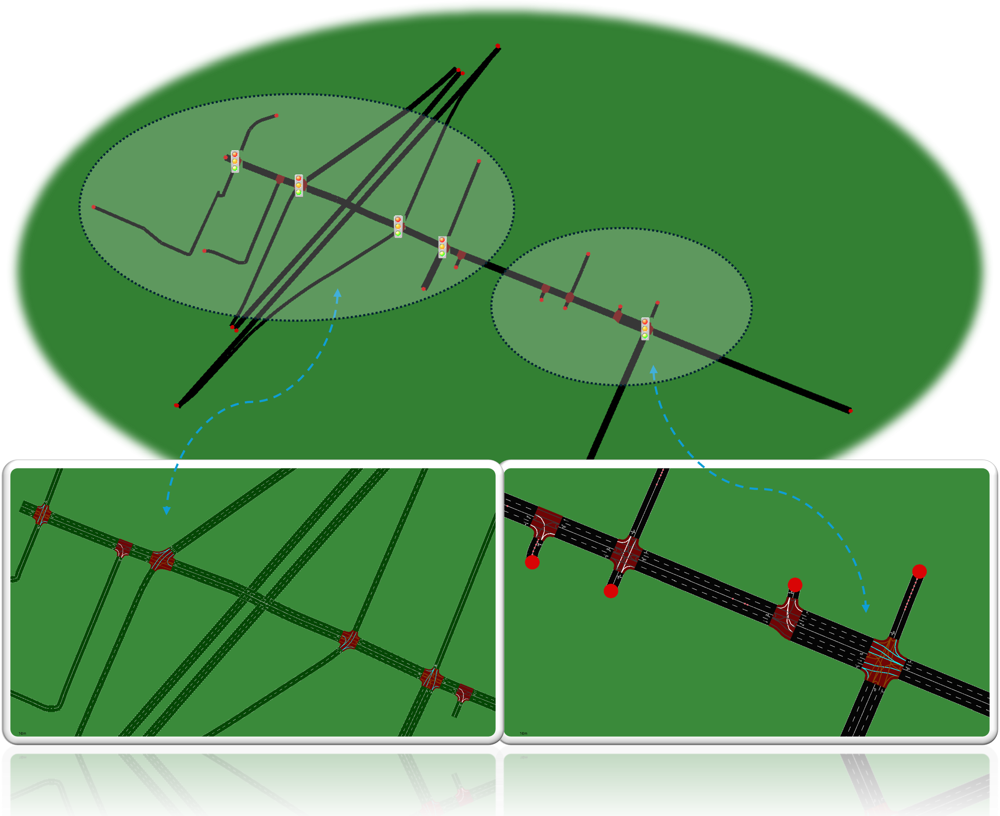

===============
About Real-Twin
===============

ORNL's Real-Twin project is a streamlined scenario generation tool that automatically integrates real-world traffic data to create high-fidelity digital twins for simulating the impacts of connected and automated vehicles in micro-simulation environments.

Real-Twin Framework
===================

The framework is designed to be user-friendly, allowing users to easily generate realistic traffic scenarios by leveraging real-world data. It supports various micro-simulation platforms and is particularly useful for researchers and practitioners in the field of transportation systems, connected vehicles, and traffic management.

.. image:: ../_static/realtwin_framework_dev.png
    :width: 100%
    :alt: Real-Twin Framework Overview

Here is a simple example of how to use Real-Twin to generate a traffic scenario

Sample Location Selection
=========================

Sample Scenario Generation
==========================

Sample Calibration
==================

.. image:: ../_static/chatt_net.gif
    :width: 100%
    :alt: Calibration Process
